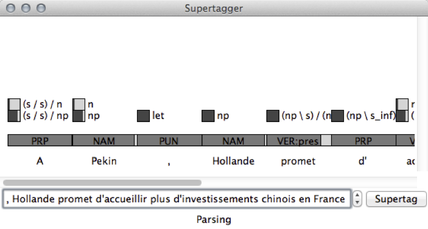
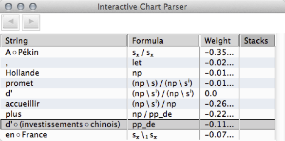

# GrailLight

:copyright: 2015-2020 [CNRS](http://www.cnrs.fr)

:copyright: 2015-2020 Richard Moot (@RichardMoot)

Grail Light is a light-weight chart parser for multimodal type-logical
grammars, written in SWI Prolog. It is accompanied by a set of auxiliary tools for interaction with the
supertagger, interactive parsing, corpus extraction, etc.

Together with [DeepGrail](https://richardmoot.github.io/DeepGrail/) or the older [part-of-speech tag and supertag models](https://github.com/RichardMoot/models), Grail Light
can function as a wide-coverage parser for French, assigning Discourse Representation Structures as the meaning of parsed sentences. Grail Light produces natural
deduction proofs like those found in the [TLGbank](http://richardmoot.github.io/TLGbank/) and uses the same conventions for formulas, rules and proofs.

# Quick Start

Clone the repository, enter the Grail Light directory, start SWI
Prolog then type.

`[grail_light_cr,annodis].`

This will load Grail Light as well as the sentences from the Annodis
corpus.

To parse a sentence, type

`sentence(2, Semantics).`

This will parse the sentence and unify _Semantics_ with the meaning
computed for this sentence.

# LaTeX Output

A successful parse will produce a LaTeX representation both of the
proof found and of the meaning. To see the LaTeX output, type the
following (in a shell terminal).

`pdflatex latex_proofs.tex`

# User interface to the part-of-speech/supertagger

Use the file `Supertag.tcl` for a TclTk user interface to the part-of-speech tagger and supertagger. You can select either the Keras LSTM taggers and models from [DeepGrail](https://richardmoot.github.io/DeepGrail/) (recommended, set the `keras_tagger_prefix` and `keras_model_prefix` in `Supertag.tcl` to the executables and models respectively) or the [Clark and Curran taggers](https://www.aclweb.org/anthology/J07-4004.pdf) with the corresponding [French models](https://github.com/RichardMoot/models) (set the `cnc_tagger_prefix` and `model_prefix` variables in `Supertag.tcl` to the executables and models respectively).

You can then simply run `Supertag.tcl` and type an input sentence into the entry field. The result of the supertagger looks as shown in the figure below.



In each case, the darker part of the bar (next to each formula) indicates the probability assigned by the supertagger to the formula (moving the mouse pointer over a formula displays the formula and its probability).

The result of the supertagger is passed as input to GrailLight, and if a proof is found, the syntactic proof can be found be selecting `Proof` from the `File` menu, and the meaning (in Discourse Representation Theory) can be found by selecting `Semantics` from the `File` menu.

The menu allows you the change the supertagger/models used and the beta value of the supertagger; essentially, larger beta values result in more formulas per word, meaning slower parsing but higher likelyhood of finding a proof). It is recommended to use a fairly high beta value (such as the default 0.1) and only decrease it when no proof is found. Several useful values are available in the `Beta` item of the `Options` menu. 

# User interface to the chart parser

Type `make parser.tcl` and start the created file `parser.tcl` to open a rudimentary TclTk interface to the chart parser. Example input files for the parser can be found in the `chart_proofs/aux` directory of the [TLGbank](http://richardmoot.github.io/TLGbank/). Giving `parser.tcl` a file as argument will open a Prolog file containing parser input. You can also load a file by selecting `Load` from the `File` menu or try.

```
head -364 annodis.pl > anno10.pl
./parser.tcl anno10.pl
```

to manually parse the first 10 sentences of the `annodis.pl` file in the repository (you can do this for the complete file as well, but this requires a quite a bit of patience reading all data).

After startup, the parser window looks as follows, changing with the input sentence and the parser actions performed.



Each table row displays the current structure, formula, log probability, and stack information of the active items in the chart (read [`chart_parser.pdf`](https://github.com/RichardMoot/GrailLight/blob/master/chart_parser.pdf) for more information about the chart parser).

You can double-click on table row to apply a chart rule to this item. When there are multiple possibilities, a pop-up allows you to select the desired one (with `<Enter>`). You can _undo_ a choice by pressing `<u>`, and _export_ the parser result by pressing `x`. 

# User interface for manually annotating and correcting additional sentences

The file `treebank_annotator.tcl` is another interface to the part-of-speech tagger and supertagger. Contrary to the `Supertag.tcl` script, this script is useful for manually annotating additional data, bootstrapping with the current output of the taggers, and manually correcting the errors, first of the part-of-speech tags, then of the supertags.

# Going Further

The file [`readme.pdf`](https://github.com/RichardMoot/GrailLight/blob/master/readme.pdf) contains more detailed instructions whereas the
file [`chart_parser.pdf`](https://github.com/RichardMoot/GrailLight/blob/master/chart_parser.pdf) describes the strategy used by the chart parser.

# Acknowledgments

This chart parser has been developed starting from source code
originally developed by Shieber e.a. (1995), though with a set of
inference rules and a number of improvements which I specifically tailored for multimodal type-logical grammars.

The Prolog file `lefff.pl` has been automatically extracted from the
[Lefff lexicon](http://alpage.inria.fr/~sagot/lefff.html) (Sagot, 2010).

The file `annodis.pl` has been extracted from the
[Sequoia corpus](http://deep-sequoia.inria.fr) (Candito and Seddah,
2012) and is part of the [TLGbank](http:richardmoot.github.io/TLGbank)
(Moot, 2015).

# References

Marie Candito and Djam&eacute; Seddah (2012) _Le corpus Sequoia : annotation
syntaxique et exploitation pour l’adaptation d’analyseur par pont
lexical_, Proceedings TALN'2012, Grenoble, France.

Richard Moot (2015) _A Type-Logical Treebank for French_, Journal of
Language Modelling **3(1)**, pp. 229-265.

Richard Moot (2017) _The Grail Theorem Prover: Type Theory for Syntax and Semantics_. In Stergios Chatzikyriakidis and Zhaohui Luo (eds.) Modern Perspectives in
Type-Theoretical Semantics, pp. 247-277.

Beno&icirc;t Sagot (2010) _The_ Lefff, _a freely available and large-coverage morphological and syntactic lexicon for French_. In Proceedings of the 7th international conference on Language Resources and Evaluation (LREC 2010), Istanbul, Turkey

Stuart M. Shieber, Yves Schabes and Fernando C. N. Pereira (1995)
 _Principles and Implementation of Deductive Parsing_, Journal of
 Logic Programming **24(1-2)**, pp. 3-36.

